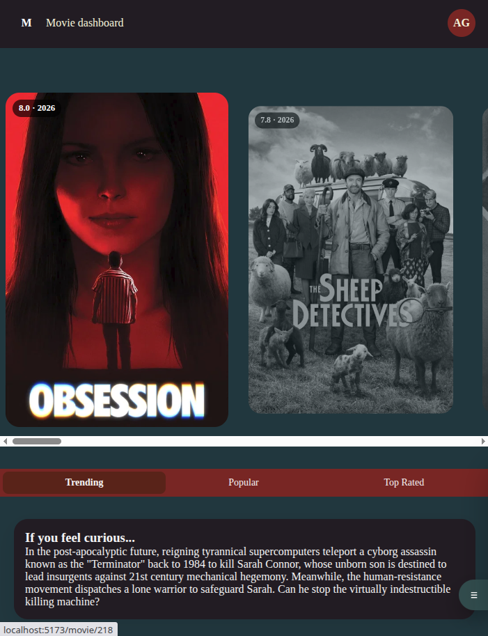

# Movie React Dashboard

Aplicación web desarrollada con **React** y **Vite** para explorar películas, buscar títulos, ver información detallada y guardar películas favoritas.

Este proyecto forma parte de mi portafolio como desarrollador frontend. El objetivo fue construir una aplicación completa consumiendo la **API de TMDB**, aplicando manejo de estado, rutas, persistencia con `localStorage`, estados de carga/error, variables de entorno y despliegue en **Vercel**.

El proyecto está pensado como una práctica real de frontend: consumir datos externos, proteger la interfaz ante datos incompletos, organizar componentes reutilizables y preparar la app para producción.

---

## Demo en vivo

[Ver proyecto en Vercel](movie-react-zeta-opal.vercel.app)

---

## Video demo

[](https://youtu.be/UJ56ZaJAqoE)
---

## Vista previa

[](TU_LINK_DEL_VIDEO)

---

## Objetivo del proyecto

El objetivo principal de este proyecto fue practicar el desarrollo de una aplicación frontend conectada a una API real.

Durante el desarrollo se trabajaron conceptos importantes como:

- Consumo de APIs externas.
- Manejo de estado en React.
- Separación de componentes.
- Rutas con React Router.
- Persistencia de datos con `localStorage`.
- Manejo de errores y estados de carga.
- Protección de la interfaz cuando la API devuelve datos incompletos.
- Uso de variables de entorno.
- Deploy en Vercel.

---

## Funcionalidades

- Mostrar películas en tendencia usando la API de TMDB.
- Buscar películas por nombre.
- Ver detalles de una película en un modal.
- Agregar películas a favoritos.
- Eliminar películas de favoritos.
- Guardar favoritos usando `localStorage`.
- Página dedicada para películas favoritas.
- Búsqueda dentro de la página de favoritos.
- Estado de carga mientras se obtienen datos de la API.
- Manejo de errores si falla la petición.
- Estado vacío cuando no hay resultados.
- Imágenes de respaldo si una película no tiene poster o backdrop.
- Rating seguro cuando la API no devuelve calificación.
- Navegación entre secciones.
- Diseño responsive.
- Deploy en Vercel.

---

## Tecnologías utilizadas

- React
- Vite
- JavaScript
- React Router
- CSS
- TMDB API
- localStorage
- Vercel
- Git
- GitHub

---

## Estructura del proyecto

```bash
src/
│
├── components/
│   ├── movie/
│   │   ├── MovieCard.jsx
│   │   ├── MovieModal.jsx
│   │   └── TrendingCarrusel.jsx
│   │
│   └── navigation/
│       ├── Favorites.jsx
│       ├── FloatingNav.jsx
│       └── SearchBar.jsx
│
├── pages/
│   ├── Home.jsx
│   ├── FavoritesPage.jsx
│   └── MovieDetail.jsx
│
├── services/
│   └── api.js
│
├── styles/
│
├── App.jsx
├── main.jsx
└── index.css